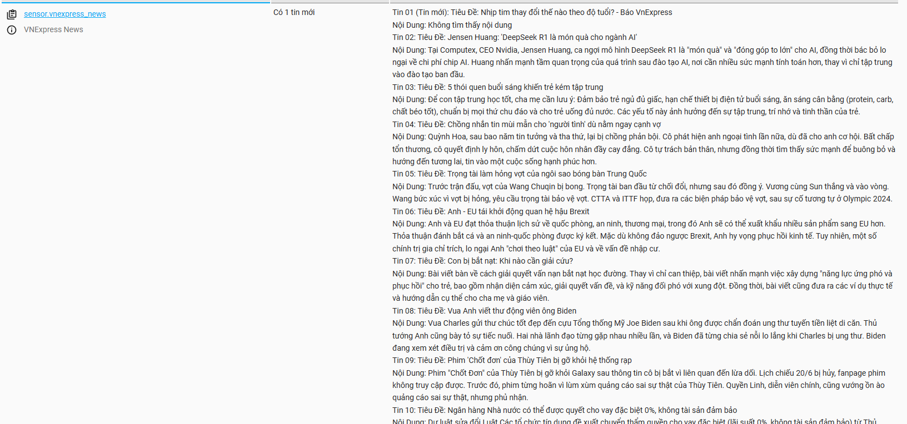

# 📰 VNExpress News Sensor for Home Assistant

Tự động lấy và tóm tắt tin tức mới nhất từ VnExpress bằng AI Gemini, hiển thị trực tiếp trong Home Assistant dưới dạng sensor.

---

## 🚀 Hướng Dẫn Cài Đặt

### 1. Tải Về & Cài Đặt

1. **Tải về và giải nén thư mục `vnexpress_news`.**
2. **Copy thư mục `vnexpress_news`** vào đường dẫn:
   ```
   config/custom_components/
   ```
3. **Copy file `config.txt`** vào thư mục `config` của Home Assistant (ngang hàng với `configuration.yaml`), sau đó chỉnh sửa dòng:
   ```ini
   GEMINI_API_KEY=your_gemini_api_key
   ```
   Thay `your_gemini_api_key` bằng API key Gemini của bạn.

4. **Sửa file `configuration.yaml`**, thêm:
   ```yaml
   sensor:
     - platform: vnexpress_news
   ```

5. **Khởi động lại Home Assistant.**

---

### 2. Lưu Ý Quan Trọng

- Lần đầu chạy sẽ **mất khoảng vài phút** do cần tạo tóm tắt cho ~60 tin.
- Mỗi lần chạy sau chỉ tóm tắt tin mới, nhanh hơn (~10-15 tin mỗi 10 phút).
- Tin tức được lưu vào file `titles.txt` để tránh gọi lại AI cho các tin cũ.

---

## ⚙️ Cách Thức Hoạt Động

1. Lấy toàn bộ tin tức mới từ RSS:
   ```
   https://vnexpress.net/rss/tin-moi-nhat.rss
   ```
   (tối đa ~60 tin gần nhất)

2. Các bài viết mới sẽ được:
   - **Lấy nội dung đầy đủ**
   - **Tóm tắt bằng Gemini AI**
   - **Lưu vào `titles.txt` để cache**

3. **Mỗi 10 phút**, sensor tự động cập nhật lại và thêm các tin mới.

4. Trạng thái sensor hiển thị:
   - `"Không có tin mới"`
   - hoặc `"Có X tin mới"` kèm các thuộc tính chi tiết từng bài viết.

---

## 🖼 Demo



---

## 📂 Cấu Trúc File

```
├── configuration.yaml
├── custom_components/
│   ├── vnexpress_news/
│   │   ├── __init__.py
│   │   ├── manifest.py
│   │   ├── sensor.py
│   │   └── ...
├── config.txt      ← cần đưa vào thư mục config của Home Assistant
├── titles.txt      ← tự sinh ra để lưu tin đã xử lý
```

---

## 📌 Ghi Chú

- Dự án giới hạn 100 bài viết gần nhất để tối ưu hiệu năng.
- API Gemini nên là bản có quota ổn định.
- Nếu sensor không cập nhật ngay, có thể do chu kỳ quét mặc định là 10 phút (`SCAN_INTERVAL = 600`).

---

## 💬 Liên Hệ & Góp Ý

Mọi đóng góp hoặc vấn đề vui lòng tạo [Issue tại đây](https://github.com/smarthomeblack/vnexpress_news/issues) hoặc liên hệ qua GitHub.

---
